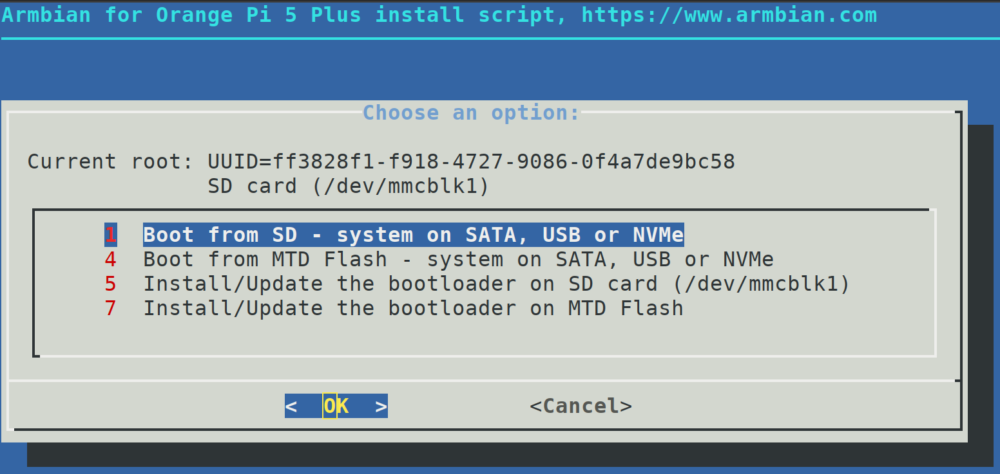
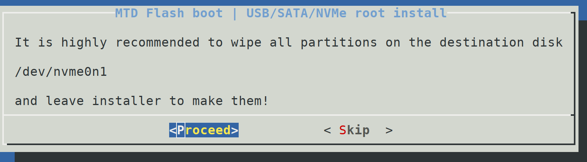
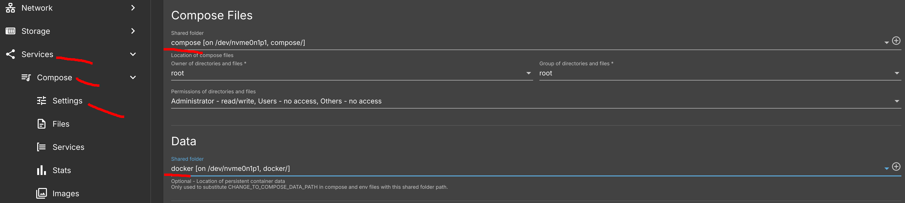
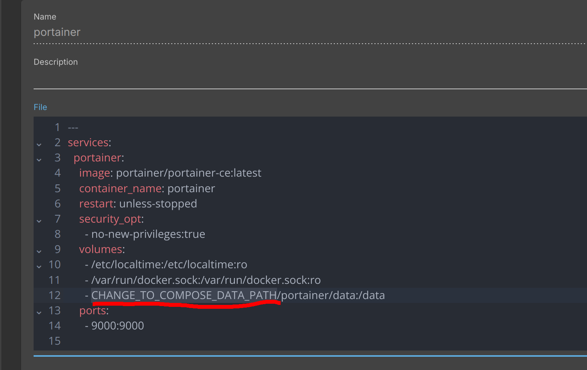

# []{#anchor}2024-11-15: Media server part 2, Orange Pi 5 Plus

So...I ended up buying the Orange Pi 5 Plus (16GB) and it has not been a
year yet since I bought the Synology DS423+. Why?

1.  I want to have a private VPN so I can access my Synology when I'm
    outside using mobile data or if I need to use a public Wi-Fi then
    using a VPN will help with privacy and security a ton.
2.  To put some Docker Containers that might need to be opened up to the
    Internet on the Pi instead so there is an extra layer of security
    than to have it all on the Synology where all the important data is.
3.  To offload some of the Docker Containers running on my Synology to
    the Pi and to run a few more with the better performance (CPU) of
    the Pi.
4.  While I'm at it, to try out a cheaper option for a Media Server/NAS
    so I can share my experience with you guys (here we are).

So, why did I pick something from Orange Pi instead of Raspberry Pi? It
is because the Orange Pi boards have quite a bit better hardware for the
money, so it is the better value in my eyes, as for the downside with
the worse support I hope that using third party OS such as Armbian will
negate that part. As for the model I picked, I started out wanting the
Orange Pi 3B as it was the cheapest but still has an ARM based SoC so
support is better than the cheaper Zero boards that uses Allwinner SoC.
But then I thought that the 3B might not be as future proofed as the
more expensive 5 lineup SoC (which is around 2x more expensive but
performance is 3-4x better, 4 vs 8 cores) so I started looking at the 5
series. The 5 series have as of this writing, 6 different versions.

3 versions with the RK3588 SoC (the 5 Plus, 5 MAX and 5 Ultra), the MAX
and ULTRA as of this post does not have any standard nor community
supported build from armbian nor dietpi (although MAX is supported by
joshua-riek´s Ubuntu-rockchip version) which is why I disqualified them
from the start. Then we have 3 versions with the RK3588S SoC (the 5, 5B
and 5 Pro), 5B does not have support from dietpi but supported on the
other 2 OS. Which leaves the 5 Plus, 5 and 5 Pro as the candidates.
Price wise it goes 5 \< 5 Pro \< 5 Plus. The 5 Pro however does NOT have
an SPI-Flash, which is needed if you want to be able to install and boot
from anything else other than the USB/SD-card and since I want to have
my boot and root partitions on the NVME SSD I bought, the 5 Pro is
disqualified. So now the final choices are the 5 and the 5 Plus.
Differences are:

  ---------------------------------------------------------------------------------------------------------------------------------------------------------------------------------------------------------------- ---------------------------------------------------------------
  Orange Pi 5                                                                                                                                                                                                      Orange Pi 5 Plus

  No eMMC socket (which is not really a problem for me right now but it does leave out room for expansion in the future, eMMC being quite a bit faster than the usual USB/SD-cards, slower than NVME SSD though)   Has eMMC socket

  single Gigabit LAN port (probably won't matter as my Internet speed isn't higher than this)                                                                                                                      dual 2.5 Gigabit ports

  1 x USB 3.0 (very helpful for adding more storage in the future)\                                                                                                                                                2 x USB 3.0\
  2 x USB 2.0\                                                                                                                                                                                                     2 x USB 2.0\
  1 x USB 3.1 Type-C                                                                                                                                                                                               1 x USB 3.0 Type-C

  PCIe 2.0 (should be a single lane) = around 500 MB/s theoretical max (8x slower) (2242 compatible) (quite the bottleneck for NVME SSDs and also not compatible with the most common 2280 size)                   PCIe 3.0 x4 = around 4 GB/s theoretical max (2280 compatible)

  1 x HDMI 2.1 (will not use a monitor so this does not matter for me)                                                                                                                                             2 x HDMI 2.1

  GPIO 26 pin header                                                                                                                                                                                               GPIO 40 pin header
  ---------------------------------------------------------------------------------------------------------------------------------------------------------------------------------------------------------------- ---------------------------------------------------------------

With all that in mind, I went with the 5 Plus as it is worth the price
increase to me and I picked the 16 GB version so It is more future proof
and because with how powerful this SoC is, going for the lowest 4 GB
version would mean you aren't making that much use of the more powerful
SoC in the 5 Plus compared to the 3B, 8 GB is my recommendation at least
but I went with 16 GB since you cannot really upgrade the RAM
afterwards. Here is the list of what I bought:

+----------------+----------------+----------------+----------------+
| Product        | Link           | Description    | Need?          |
+----------------+----------------+----------------+----------------+
| Acrylic case   | <https://www.  | A cheap case   | Mandatory, you |
| with heatsink  | aliexpress.com | to lift the Pi | need some form |
| and fan kit    | /item/10050056 | off the ground | of cooling and |
|                | 37567338.html> | a bit, useful  | with how       |
|                |                | heatsink. Fan  | powerful the   |
|                |                | I do not use   | SoC is, active |
|                |                | but should be  | cooling is     |
|                |                | decent.        | preferable     |
+----------------+----------------+----------------+----------------+
| NVME SSD       | <https://www.  | No active      | Not mandatory, |
| Thermal pad    | aliexpress.com | cooling on the | but likely     |
| (70x20x3.0mm)  | /item/10050059 | NVME so a      | better for SSD |
|                | 14728082.html> | passive        | health for     |
|                |                | thermal pad    | long term.     |
|                |                | will help.     | Either this or |
|                |                | Hovers around  | the COOLLEO    |
|                |                | 50C in idle    | heat sink      |
+----------------+----------------+----------------+----------------+
| COOLLEO M.2    | <https://www.  | No active      | Not mandatory, |
| 2280 SSD heat  | aliexpress.com | cooling on the | but likely     |
| sink           | /item/10050072 | NVME so a      | better for SSD |
|                | 21906478.html> | passive heat   | health for     |
|                |                | sink will      | long term.     |
|                |                | help. Hovers   | Either this or |
|                |                | around 30C in  | the Thermal    |
|                |                | idle (20C      | pad.           |
|                |                | lower than     |                |
|                |                | thermal pad)   |                |
+----------------+----------------+----------------+----------------+
| NETAC SD Card  | <https://w     | Need an sd     | Not mandatory, |
| 64GB           | ww.aliexpress. | card to first  | you just need  |
|                | com/item/40005 | install the OS | an SD card     |
|                | 61924634.html> | (can then move | (and           |
|                |                | to entirely    | a              |
|                |                | using NVME     | dapter/reader) |
|                |                | only).         | for the first  |
|                |                |                | install but if |
|                |                |                | you do not     |
|                |                |                | have one       |
|                |                |                | already, this  |
|                |                |                | should be      |
|                |                |                | good.          |
+----------------+----------------+----------------+----------------+
| 6-In-1 USB     | <https://www.  | USB adapter    | Mandatory, if  |
| adapter        | aliexpress.com | for the SD     | you do not     |
|                | /item/10050058 | Card so you    | have one.      |
|                | 72584302.html> | can use it     |                |
|                |                | with your PC.  |                |
+----------------+----------------+----------------+----------------+
| NETAC NVME SSD | <https://www.  | Cheap and from | Not mandatory, |
| 1TB            | aliexpress.com | my research    | but good to    |
|                | /item/10050037 | apparently a   | have an NVME   |
|                | 94707357.html> | good brand for | for Boot/root  |
|                |                | SSDs on        | partition for  |
|                |                | AliExpress     | maximum speed. |
|                |                | (rare). Got    |                |
|                |                | 1TB since only |                |
|                |                | one NVME slot  |                |
|                |                | and I needed a |                |
|                |                | bit more than  |                |
|                |                | 500GB.         |                |
+----------------+----------------+----------------+----------------+
| UGREEN CAT8    | <https://www.  | Need an        | Mandatory, you |
| Ethernet cable | aliexpress.com | Ethernet cable | need a wired   |
| (Flat PVC      | /item/10050068 | to connect     | Ethernet cable |
| version)       | 95115843.html> | with the       | to use with    |
|                |                | router wired.  | router.        |
|                |                | Picked a       |                |
|                |                | random one     |                |
|                |                | from a         |                |
|                |                | reputable      |                |
|                |                | brand on       |                |
|                |                | AliExpress.    |                |
+----------------+----------------+----------------+----------------+
| Orange Pi 5    | <https://www.  | Bought with    | Obviously the  |
| Plus (with     | aliexpress.com | the power      | key part in    |
| power supply   | /item/10050056 | supply (5V 4A) | the setup.     |
| option)        | 21748337.html> | in case I need | Power supply   |
|                |                | it.            | is not needed  |
|                |                |                | though if you  |
|                |                |                | go with the    |
|                |                |                | UPS.           |
+----------------+----------------+----------------+----------------+
| Waveshare UPS  | <https://www.  | UPS so if the  | Not mandatory, |
| Module 3S (EN) | aliexpress.com | power goes     | but HIGHLY     |
|                | /item/10050050 | down it should | recommended.   |
|                | 81170621.html> | either         |                |
|                |                | gracefully     |                |
|                |                | shut down      |                |
|                |                | without        |                |
|                |                | da             |                |
|                |                | mage/data-loss |                |
|                |                | or keep        |                |
|                |                | running on     |                |
|                |                | battery until  |                |
|                |                | power comes    |                |
|                |                | back.          |                |
+----------------+----------------+----------------+----------------+
| INR18650 MH1   | Swedish store  | Need 3 x 18650 | Mandatory (3x  |
|                | (find your own | batteries for  | 18650          |
|                | store          | the 3S UPS I   | batteries) if  |
|                | locally):      | paid around 18 | you go with    |
|                | <http          | usd for        | the UPS.       |
|                | s://www.electr | them           |                |
|                | okit.com/batte | .[]{#anchor-1} |                |
|                | ri-li-ion-1865 | You need to    |                |
|                | 0-3.7v-3200mah | find your own  |                |
|                | -inr18650-mh1> | locally (avoid |                |
|                |                | AliExpress as  |                |
|                |                | there are many |                |
|                |                | fakes and      |                |
|                |                | shipping is    |                |
|                |                | extremely slow |                |
|                |                | with batteries |                |
|                |                | there and      |                |
|                |                | price is the   |                |
|                |                | same as        |                |
|                |                | local), key    |                |
|                |                | words being    |                |
|                |                | 3.7V, 18650,   |                |
|                |                | flat top and   |                |
|                |                | unprotected.\  |                |
|                |                | Another model  |                |
|                |                | that looks     |                |
|                |                | good/popular   |                |
|                |                | is the         |                |
|                |                | INR18650-35E). |                |
|                |                | Here are some  |                |
|                |                | measurements:  |                |
|                |                | <https         |                |
|                |                | ://lygte-info. |                |
|                |                | dk/review/batt |                |
|                |                | eries2012/LG%2 |                |
|                |                | 018650%20MH1%2 |                |
|                |                | 03200mAh%20(Cy |                |
|                |                | an)%20UK.html> |                |
|                |                | <https://lyg   |                |
|                |                | te-info.dk/rev |                |
|                |                | iew/batteries2 |                |
|                |                | 012/Samsung%20 |                |
|                |                | INR18650-35E%2 |                |
|                |                | 03500mAh%20(Pi |                |
|                |                | nk)%20UK.html> |                |
+----------------+----------------+----------------+----------------+
| 12.6V 2A       | <https:/       | Charger for    | Not needed if  |
| Charger        | /www.aliexpres | the UPS        | Waveshare      |
|                | s.com/item/329 |                | includes the   |
|                | 76610933.html> |                | charger with   |
|                |                |                | the UPS, the   |
|                |                |                | link I bought  |
|                |                |                | from did.      |
+----------------+----------------+----------------+----------------+
| Noctua         | <http          | Better fan     | Not mandatory, |
| NF-A4x10 5V    | s://noctua.at/ | that is        | upgraded fan   |
|                | en/products/fa | essentially    | over the one   |
|                | n/nf-a4x10-5v> | inaudible and  | that comes     |
|                |                | excellent      | with the       |
|                |                | cooling        | acrylic case   |
|                |                | cooling. (make | kit. Use the   |
|                |                | sure it is the | stock one or   |
|                |                | 5V and without | this Noctua    |
|                |                | PWM version)   | fan.           |
+----------------+----------------+----------------+----------------+
| O-ring         | <https:/       |                | Needed if you  |
| (4x2x1mm)      | /www.aliexpres |                | want to fasten |
|                | s.com/item/329 |                | the Noctua fan |
|                | 52893714.html> |                | in place.      |
+----------------+----------------+----------------+----------------+

Alright, so now you have all the hardware you need. There are now
multiple ways to go about the OS:

1.  Armbian (<https://www.armbian.com/orange-pi-5-plus/>)
2.  Joshua-Riek Ubuntu-Rockchip
    (<https://github.com/Joshua-Riek/ubuntu-rockchip>)
3.  DietPi (<https://dietpi.com/#downloadinfo>)
4.  Optional; if you want to use the Pi as a NAS, you need to install
    OpenMediaVault
    (<https://docs.openmediavault.org/en/stable/installation/on_debian.html>
    <https://www.openmediavault.org/> ) on top of the OS in which case
    you need a Debian based OS and so the Joshua-Riek Ubuntu Rockchip OS
    cannot be used for that. I am doing this so using Armbian is the
    easiest way to then install OMV as there is a built in
    armbian-config tool to install OMV in a single step with all
    performance and reliability tweaks included.

# []{#anchor-2}Preparation

1.  Connect the three 18650 batteries to the UPS and then assemble the
    UPS (you need to connect the Type-C, Switch button and DC5521 cables
    to the UPS) take a look at the official
    [pictures](https://www.waveshare.com/ups-module-3s.htm) and you
    should be able to assemble it even without a guide. When done, plug
    in the charger into it and let it charge in the meantime.

2.  Download Armbian (Armbian 24.8.1 Bookworm Minimal / IOT Kernel:
    6.1.75, Size: 225.6 MB, Release date: Aug 26, 2024, being the latest
    during this post) image over here
    <https://www.armbian.com/orange-pi-5-plus/> and then install
    Raspberry Pi Imager <https://www.raspberrypi.com/software/> (works
    on Windows, Linux and macOS).

3.  Plug in your SD card with the adapter into the pc and open RPI
    Imager. This will wipe the data on the SD card so make sure to make
    a backup of any files you want to keep on it if it is an old card.

4.  Select "no filtering" on the "Raspberry Pi Device category, "Erase"
    for the Operating System" category" and **be sure** to select the
    correct "Storage" device (the **SD CARD**!). Click next and agree to
    the warning popup about the data wipe, wait until it is done and it
    is fully wiped and formatted to FAT32.

5.  Next, install the Armbian minimal image by first clicking on the
    "Choose OS" and selecting "Use custom" and then select the image you
    just downloaded. Then select the SD card in the Storage category and
    set the "Raspberry Pi device" to "no filtering". Click next after
    all 3 categories have been set, make sure it is the correct device
    (SD CARD!).

6.  You will get a popup asking if you wan to customize it, click NO and
    then another popup warning you that it will wipe the data on the
    card, click yes to continue. Wait until it is done and then you can
    disconnect the card from the PC.

7.  Assemble the case for the Pi, I am using the Noctua 40mm fan which
    is too big for the included top cover so I ditched it and have the
    board elevated a bit over the ground instead (which should help give
    the NVME SSD some more airflow and should be cooler for the board as
    the SSD is not close to the board now). You can connect the Noctua
    fan with 3pin and then it should only activate above a certain
    temperature (55 degrees Celsius as far as I know) or connect it with
    the included 3pin → 2pin adapter and it will be constantly activated
    at max power (it is barely audible and drains next to no power).
    Connect to these pins (5V and GND) if using the 2pin adapter:

(if using 3 pin I believe (not 100% sure) you want
    to connect the third yellow wire to the GPIO1_A1 pin.)

# []{#anchor-3}Installation/First Boot From SD Card

1.  Connect the SD card, NVME drive and Ethernet cable to the Pi. Then
    connect the UPS USB-C power cable to the Pi LAST.

2.  Login to the Pi using SSH, you first need to find the IP address the
    router assigned to it. Do so by either login in to the router
    settings and look it up there (every router brand is different so
    look up how to do so on your specific router). Here is how it looks
    for me.

    

3.  With the IP address known, you then need to use SSH to login to it,
    on Windows 10/11 SSH should be enabled by default otherwise check
    these guides on how to enable them (Windows
    [10](https://www.youtube.com/watch?v=zsZMKsZHXEE)/[11](https://www.youtube.com/watch?v=wS2DYEu7C0o)),
    you can just use the Terminal on Linux and on Windows you can
    use CMD. I will be using the IP address my Pi got but you need to
    use yours, type in: "ssh <root@192.168.0.114>", click yes if it
    warns you about the authenticity and then when it asks for the
    password type in "1234"

4.  It will now ask you to change the password for the root user, pick a
    random but STRONG password (save it in a password manager or
    something like that).

5.  Then you need to create a user account by picking a username,
    password and then your real name. I just picked the same name for
    both ones, and a random password. After that it will ask you about
    language and timezone, you can pick on your own or select the
    default one for you. After all that you should see this:

     Continue with the next chapter right after this
    (Boot from NVME SSD) or skip that if you do not have an NVME SSD
    that you want to boot from.

# []{#anchor-4}Boot from NVME SSD

1.  Follow the official Manual (
    <https://drive.google.com/file/d/1qJcShkcYlMZdgdr5HVqTmpcYxUYuP-aE/view>
    ) Chapter 2.6.2 "How to use balenaEtcher software to program" from
    step 1 to the end of step 9.
2.  Confirm that the Pi can see the SSD by typing in
    "lsblk" in the terminal for ssh after the last step from the
    previous chapter.
    
3.  Here you can see that the Pi can see the nvme drive, it is called
    "nvme0n1" and you can see the sd card as well "mmcblk1" with a
    single partition called "mmcblk1p1"
4.  Now we need to create 2 partitions for the nvme, type in
5.   Now type in "armbian-install" and this is what you should see:
6.  Select option 7 (use arrow keys to navigate) and
    click yes and WAIT (no progress bar so might look like it is not
    doing anything but WAIT, took me around 5 minutes).
7.  After you get the done message, you might need to
    clear the screen type in "clear". Then type in "armbian-install"
    again. This time select option 4. Click proceed to the wipe warning
    and check so it is wiping the nvme drive (nvme0n1)
8.  Click proceed to the automated installation.
9.  Select ok and it will create a single partition
    "nvme0n1p1".
10. yes.
11. If you have an nvme that is bigger than 1TB, then
    I would go for btrfs since it is beneficial for OpenMediaVault, but
    since I only have 1TB I cannot use that and need to go for ext4,
    click ok and WAIT.
12.  Click yes (already did this but do it again to be
    sure) and WAIT.
13. When done select "power off", wait a minute or two to make sure it
    has been turned off properly (the LED should still be on with red
    color indicating that it is connected to a power cable).
14. Go to the Pi and remove the sd card then click on
    the power button on the Pi. Go back to the router page and check if
    the IP address is still the same or not, in my case it changed from
    114 to 113 at the end. Go to the Terminal and ssh into it again
    using "ssh <root@192.168.0.113>" and type in the root password.
15. Now if you
    managed to boot into it, we already know it is a
    success but you can check with the "lsblk" command in the terminal. 
16. Armbian is now installed, run "sudo apt update" if there are
    upgrades available, run "sudo apt upgrade". You may keep the SD Card
    as a backup in case something goes wrong later then you just need to
    remove the SSD and put in the SD card and boot from here.
17. Go to the "Change SSH Port (before OpenMediaVault Installation"
    chapter next.

# []{#anchor-5}Change SSH Port (before OpenMediaVault Installation)

1.  Change the port used for SSH to improve security, pick a random
    number between 49152--65535.
2.  Type in "nano /etc/ssh/sshd_config" in the terminal. 
3.  Change the port number 22 to the random one you
    picked and remove the "#" symbol. Click ctrl+x on the keyboard to
    exit afterwards and click "y" on the keyboard to save and click
    enter to overwrite the old file with the new one. You can confirm if
    it saved by typing in the same code in the terminal.
4.  Type in "systemctl restart ssh" and open a NEW terminal (do not exit
    the old one until we confirmed we can use the new port so we are not
    locked out of it).
5.  Type in "ssh -p PORT <root@192.168.0.113>" (use the random ssh port
    you picked on step 3) and login with the root password. If logged
    in, the ssh port is now set and confirmed to be working with the new
    one REMEMBER IT (save it in a password manager).
6.  Go to the "Permanent IP Address" chapter next.

# []{#anchor-6}**Permanent IP Address** 

1.  Go to the router web ui page and set a permanent IP address for the
    Pi so it does not change. Every brand is different, so look
    up how to do it on yours. 
2.  Type in "reboot" in the terminal to reboot and get the new and
    permanent IP address you assigned to it. Then when you SSH into it
    you need to use the new IP address. Example if you gave it
    192.168.0.10 the code would be " ssh -p PORT <root@192.168.0.10>"
    (with the PORT being the SSH port you randomly picked).
3.  Go to the next chapter "Install Pi-hole (DNS)"

# []{#anchor-7}Install Pi-hole (DNS)

1.  Type in "ip addr" in the terminal, check which one is in use between
    the interfaces (ignore the first "lo"), here it is the
    enP4p65s0.
2.  Type in "curl -sSL https://install.pi-hole.net \| bash" in the
    terminal to run the automatic installer. You should see this
    afterwards.
3.  Click ok, twice, then continue when it says you
    need a static IP which we already did in the previous chapter.
4.  Select the interface that is in use which we found out in step 1 to
    be
    enP4p65s0 here.
5.  Select the upstream DNS provider, I picked Cloudflare.
6.  Select yes to use the default block list.
7.  Select yes to have Web UI to manage it easier.
8.  Yes.
9.  Yes
10.  Select "show everything" and then WAIT.
11. Open up the web page by opening a new tab in your
    browser and type "192.168.0.50/admin" (example IP) then log in with
    the password shown (SAVE IT) Click ok when done.
12. Go to the next chapter "Install PiVPN"

# []{#anchor-8}Install PiVPN

1.  Type in "curl -L https://install.pivpn.io \| bash" in the terminal.
2.  Click ok (works for Orange Pi as well as other
    SBCs, not just Raspberry Pi´s).
3.  ok
4.  Yes
5.  Ok
6.  ok
7.  Select your user.
8.  Pick between WireGuard or OpenVPN, WireGuard is
    what I use and is what is mostly recommended as far as I know.
9.  Use the default port and confirm it.
10. Yes.
11. Use public IP
12. Ok
13. Yes
14. ok
15. yes and it will reboot.
16. After the reboot you might need to close and open
    the terminal again and ssh into it, we want to create client
    profiles, type in "pivpn add" and enter a name for
    the client, since I want the client to be my Phone
    I will just name it the Xperia5V. 
17. Go to your router settings and add a port forward
    rule to forward all from 51820 via UDP.
18. Download the WireGuard app on whatever device you
    want to connect to the Pi remotely, in my case it is my
    [Android](https://play.google.com/store/apps/details?id=com.wireguard.android)
    phone.
19. Type in "pivpn
    -qr" in the terminal and enter the name of the
    client you created at step 16, in my case "Xperia5V", a QR code
    should be shown now.
20. Open the WireGuard app and click the plus icon at the bottom right
    and select "scan from QR Code" and scan the QR code shown in the
    terminal.
21. Give it a name, I just called mine "PiVPN-OPi5P" and click on the
    create tunnel.
22. To confirm that it is working, use your mobile data (and no Wi-Fi)
    and check what your IP address is
    [here](https://whatismyipaddress.com/) then enable the VPN in the
    app and check what the IP address is again. It should now show a
    different address. And in my case the VPN address is very similar to
    the IP address I have when on my Wi-Fi and the location shown on
    that site is much closer to my real location compared to mobile data
    which isn't as accurate. You can also check the Pi-hole Web UI page
    and it should have some queries and clients now after that test.
23. To use Pi-hole as your DNS on PC, you need to
    change your DNS settings to the IP address of the Pi, [Windows
    10](https://www.windowscentral.com/how-change-your-pcs-dns-settings-windows-10)/[Windows
    11](https://mariushosting.com/synology-use-pi-hole-as-dns-on-windows-11/).
24.  Go to the next chapter "Install OpenMediaVault".

# []{#anchor-9}Install OpenMediaVault 

1.  First check for updates, type "apt update" if there are run "apt
    upgrade" afterwards.
2.  Type in "wget -O -
    https://github.com/OpenMediaVault-Plugin-Developers/installScript/raw/master/install
    \| sudo bash" in the terminal, WAIT.
3.  Open a new page in your browser and type in the IP
    address of your Pi, you should see the login page for OMV, if not
    immediate wait a few minutes and check your router Web UI to see if
    the Pi is still on and active.
4.  Login with user name "**admin**" and
    "**openmediavault**" for password.
5.  Since OMV uses the same port (80) as Pihole
    for the Web UI we need to change it so it does not conflict with
    pihole.
6.  SSH into the terminal "ssh
    **[root@IPADDRESS](mailto:root@IPADDRESS)**" (using the IP
    address of the Pi).
7.  Type in "omv-firstaid" and select 3 "configure workbench"
8.  Change the port to 8080.
9.  Then use the link it gives you to go to the Web UI
    for OMV.
10. Change the password for your admin user in
    OpenMediaVault (and activate dark mode if you want to).
11. The SSH port has been changed back to the default
    22, to change it go to "services" and "SSH" and then input the port
    there.
12. Then apply 

13. Go to the next chapter "Install docker"

# []{#anchor-10}Install Docker

1.  SSH into the Pi, type in "wget -O -
    https://github.com/OpenMediaVault-Plugin-Developers/packages/raw/master/install
    \| bash" in the terminal and WAIT.
2.  Go back to the Web UI for OpenMediaVault and press ctrl + shift + R.
3.  Go into "System" then "omv-extras" and check the box for "Docker
    repo" and click save and WAIT.
4.  Go into "Plugins" and search for compose and click
    on it.
5.  Install it.
6.  If this happens, click on the close button and
    click on the install button again.
7.  If this happens again (did for me), press ctrl +
    shift + R and check the page if it has not been installed already,
    it did for me.
8.  Go to "Storage" and then "shared folders" and
    click on the plus icon.
9.  Name the shared folder docker (where docker related
    files will be stored) and select the drive you want it to be on, in
    my case I want it to be on my NVME SSD (and its the only drive I
    have right now) and click save and click on the apply button when
    the yellow popup comes up.
10. Create another shared folder called "compose" and
    select the same drive. Then save and apply. 

11. Go to "users" and then "groups" and create a "docker-group"

12. Then click on it and then the "shared folder
    permissions" button

13. Give it
    read/write access and save.

14. Go to "users" and then "users" and click the plus icon to create
    another user, name it "dockeruser" (or whatever but this is for
    docker specifically), give it a password and put it inside "docker",
    "docker-group", "openmediavault-admin", "openmediavault-config" and
    "sambashare" groups. And click on the "disallow account
    modificiation. Then save and apply. 

15. Go to "services", "compose" and "settings" and select the compose
    folder under the shared folder for compose files and select the
    docker folder under data, scroll all the way to to the bottom and
    click save and apply changes with the yellow popup.

16. Then click on the reinstall docker button and
    WAIT.

17. Click close when done.

18. SSH into the Pi with the terminal and type in
    "docker compose version", then "docker ps", then "docker -v", then
    "id admin" and lastly "id dockeruser". To check that docker and
    compose are installed properly and to check the ID of the
    dockeruser.

    

19. **(You may skip this step to the end of this chapter if you prefer
    to manage your Docker Containers via OpenMediaVault, I am used to
    Portainer from my Synology NAS and it has templates that makes
    installing containers easier)** Go to "services", "compose" and
    "files". Click on the plus icon and then select "portainer --
    portainer" and name it "portainer" and save and apply.

20. Go to the "storage", "shared folders" page and
    copy the absolute path for the docker folder.

21. Go back to the "services", "compose" and "files"
    page and click on the edit button for portainer.

22. Then change the "CHANGE_TO_COMPOSE_DATA_PATH" to
    the absolute path for the docker folder from step 20.

23. Click save

24. Now click on portainer and click on the up icon and
    wait.

25. When "end of line" appears, click close.

26. Go to the "services" page and you can see the
    container running.

27. Open
    "[http://IPADDRESS:9000](http://IPADDRESS:9000/)" in another
    page in the browser and create your account.

28. Click "get started" 

19. Then the edit icon.

20. Add the IP address of the Pi there and click on
    the "update environment".

21. Environment updated to local should be seen.

22. Click on "registries" and "add registry"

23. Click on "custom registry" and put "GHCR" under
    name and "ghcr.io" under URL then add registry button.

24. Repeat step 33 twice, first with "CODEBERG" under
    name and "codeberg.org" under URL and then with "Quay.io" under name
    and "quay.io" under URL.

25. Should look like this.

26.  Go to the next chapter "copying music folder"

# []{#anchor-11}File Transfer and Synchronization

1.  There are many ways to transfer or synchronize your files from PC
    (or any other source like a phone or another NAS) to the Pi such as
    SMB (Samba) which would allow you to mount the Pi as a network drive
    on your PC and just copy over files like it is a regular hard drive
    inside the PC. I prefer to use Syncthing to automate things and so I
    can adjust it to be either one way upload to the Pi or a two-way
    synchronization.

2.  Create a new shared folder under "storage", "shared folders" and
    click on the plus icon. Name it Music (this will be the folder used
    to store all your music files, you can name it something else if you
    want to) and select the NVME SSD for the file system and save then
    apply.

3.  Go to your Portainer Web UI and click on "settings" and paste this
    URL into the URL field
    "<https://raw.githubusercontent.com/pi-hosted/pi-hosted/master/template/portainer-v2-amd64.json>"
    and save.

    {width="6.05in"
    height="3.0035in"}

4.  Check the ID for the docker-group you created before by typing "id
    dockeruser" in the terminal after SSH into the Pi. In my case
    docker-group is 1002 and dockeruser is 1001.

5.  {width="6.05in"
    height="0.5043in"}Check the absolute path for docker and Music
    folders. They are /docker and /Music.

6.  {width="6.05in"
    height="1.5827in"}Go to the "users", "groups" and click on the
    permission icon for the group called "docker-group".

7.  {width="6.05in"
    height="3.0146in"}Make sure it has read/write for both docker and
    Music shared folders.

    {width="6.05in"
    height="1.7264in"}

8.  {width="6.05in"
    height="1.2311in"}Go to "templates", "applications" and search for
    "syncthing" in the portainer Web UI and click on it.

9.  Change the PUID (user ID) to 1001 (for dockeruser) and PGID (group
    ID) to 100 (for users group as the Music folder is owned by it) and
    click on the show advanced options button.

10. {width="6.05in"
    height="4.2465in"}Make sure the host for the /config path is
    "/docker/syncthing/config" and the container /Music has /Music as
    the host path. Both with bind and writeable settings.

    {width="6.05in"
    height="1.5228in"}

11. Then click on deploy container.

12. Click "containers" and then the link under "8384:8384" which should
    open the Syncthing Web UI.

13. {width="6.05in"
    height="1.4228in"}Yes or no, up to you.

14. {width="6.05in"
    height="4.1457in"}Click on the settings button, then "GUI" and
    create your user and password and then save, you will be logged out
    and need to sign in with the just created user.

15. {width="6.05in"
    height="2.5535in"}Now you need to have Syncthing installed on your
    PC (or the device you want to file transfer/synchronize) check
    [here](https://syncthing.net/downloads/).

16. Click on the "add remote device" on Syncthing running on the Pi.

17. {width="6.05in"
    height="1.4882in"}Go to the Web UI for the PC Syncthing and click on
    the "identification" under "This device" and copy the ID there.

18. {width="6.05in"
    height="3.389in"}Paste it in the Pi Syncthing Web UI under "device
    ID" and name it whatever you want, this is my Synology DS423+ so
    that is the name I use, click save.

19. {width="6.05in"
    height="3.4209in"}Over in the PC Syncthing Web UI, you should get a
    notification click add device to pair them.

20. {width="6.05in"
    height="1.4252in"}Give it a name and click save.

21. {width="6.05in"
    height="2.6591in"}The paired device should be under "Remote Devices"
    and the same for the Pi over on the other Syncthing.

22. {width="6.05in"
    height="2.4799in"}Over on the PC Syncthing, you need to add the
    music folder. I am syncing the Music folder I have on my Synology
    NAS so the path for me looks like this.

23. {width="6.05in"
    height="3.7272in"}I will be doing a two way sync but I recommend to
    use send only first to check so everything is working. After the
    folder has been fully scanned, you need to share it to the Pi.

24. {width="6.05in"
    height="3.3366in"}Go to the sharing tab and click on the Pi and
    click save.

25. {width="6.05in"
    height="3.2693in"}Over in the Syncthing for the Pi, you should get a
    popup asking if you want to add the Music folder, click add.

26. {width="6.05in"
    height="1.2945in"}Change folder path to "/Music".

1.  {width="6.05in"
    height="4.1319in"}Go to the advanced tab and change folder type to
    "receive only". Click save.
2.  {width="6.05in"
    height="2.9626in"}Wait until it has finished transferring the files,
    as this is a "send" then "receive" only folder, nothing will be
    deleted if anything goes wrong so check that the files are all there
    once it is finished. If everything works you can if you want, change
    the folder settings on both Syncthing Web UI to be "send & receive"
    so they are synchronized or leave it as it is if you want them to be
    separate.
3.  Go to the next chapter "Install Navidrome" to setup the music
    server.

# []{#anchor-12}Install Navidrome

1.  Use the terminal and SSH into the Pi. Type in "sudo mkdir -p
    /docker/navidrome"

2.  Then "sudo chown -R dockeruser:docker-group /docker/navidrome".

3.  Then "sudo chmod 775 /docker/navidrome"

4.  Go "services", "compose" and then "files" and click the plus icon
    and then the "add from example" button.

5.  {width="6.05in"
    height="3.2134in"}Search for navidrome in the example field and name
    it navidrome and then save.

6.  {width="6.05in"
    height="1.3382in"}Remove these lines.

    {width="5.8902in"
    height="3.2862in"}

7.  Click on navidrome and then edit it, change user to "1001:100" (or
    whatever the ID is for your "dockeruser" user and "user" group), add
    this environment variable " ND_MUSICFOLDER: /Music", remove
    "ND_BASEURL: "navidrome.\$URL" and change the volumes to match the
    picture shown below. Save and apply. For more customization check
    [here](https://www.navidrome.org/docs/usage/configuration-options/)

8.  {width="6.05in"
    height="2.4126in"}click on it and click on the arrow up symbol to
    start it.

9.  Once started open a new page in your browser and go to
    "<http://IPADDRESS:4040/>" (replace with your Pi address) and create
    your admin user.

10. {width="6.05in"
    height="4.4291in"}Once in you should see your music as it begins to
    scan the music folder.

11. {width="6.05in"
    height="2.8409in"}Took around 12 minutes to fully scan my music
    which is around 520GB.

12. Now you need a client that is able to connect to your navidrome
    server. Any client that is compatible with subsonic will work with
    navidrome as well. Take a look
    [here](https://www.navidrome.org/docs/overview/#apps) for a list of
    clients. I use and recommend
    [Feishin](https://github.com/jeffvli/feishin) (Windows/Linux/Mac)
    and [Symfonium](https://symfonium.app/) for Android, for iOS I do
    not use it so check the list yourself.

    {width="1.4626in"
    height="3.1335in"}{width="1.4846in"
    height="3.2346in"}{width="1.4791in"
    height="3.2161in"}{width="1.4862in"
    height="3.2563in"}

12\. **(Will show you how to connect with Symfonium but procedure is the
same for the other clients basically) **Go to the settings in Symfonium,
click on the settings button to the bottom right, "manage media
providers", then "add media provider" and select "(open) Subsonic", then
input the IP address of the Pi (192.168.0.50 for example), port "4040"
and the admin username and password you created at step 9, then scroll
to the bottom and click on "add". Wait for it to scan the server and you
are done! Whenever you want to access your music when you are out of
your LAN, you just need to open the WireGuard app and connect to the VPN
tunnel you created.

You are now done with the mandatory stuff you need for your music
server, if you want to read more on how to add more features you can
continue reading on but otherwise you can stop here.

# []{#anchor-13}What to install next?

Some suggestions on what you may want on your server.

-   [glances](https://github.com/nicolargo/glances): as a way to monitor
    the performance/resources of the Pi (can install from the compose
    tab in OpenMediaVault using "add from example", just change the
    third volume to " - /docker/glances:/glances/conf")
-   [Dozzle](https://dozzle.dev/): log and resource viewer for Docker
    Containers (can install from the compose tab in OpenMediaVault using
    "add from example", just change port 8888 to 8889)
-   [Speedtest
    Tracker](https://github.com/henrywhitaker3/Speedtest-Tracker): to
    measure your network speed

1.  {width="6.05in"
    height="1.6398in"}Go to Portainer and open "Templates", then
    "Application" and search for speedtest and click on "Speedtest
    Tracker".

2.  Click on "show advanced options", and change volume mapping host to
    "/docker/speedtest-tracker" and click on deploy container.

3.  {width="6.05in"
    height="4.3665in"}Then open a new tab and go to
    "<http://IPADDRESS:8765/>" for the Web UI.

4.  {width="6.05in"
    height="2.2953in"}I have mine set to run every 3 hours, you do so by
    going to the settings page (top right) and under "schedule" input
    this "0 \*/3 \* \* \*"

-   [FileBrowser](https://filebrowser.org/features): a file
    browser/editor in Web UI

1.  Go to Portainer and search for filebrowser in the templates
    application page. Use "FileBrowser latest". Show advanced options
    and change the volume mapping to the picture shown below. This will
    enable you to browse/edit the whole disk, if you don't want to give
    it full access you can just specify what folders you want it to
    access instead. (But I use the whole disk as it is much more
    convenient.) Then deploy the container.
2.  {width="6.05in"
    height="3.2382in"}Go to "<http://IPADDRESS:8082/>", and login with
    "admin" for both username and password.
3.  Change your password by going into settings.
4.  {width="6.05in"
    height="1.8945in"}Then change your username by going to "user
    management".

{width="6.05in"
height="4.9835in"}

-   [Uptime-Kuma](https://github.com/louislam/uptime-kuma): monitoring
    tool (can install from the compose tab in OpenMediaVault using "add
    from example", just change the first/only volume to "-
    /docker/uptime-kuma/data:/app/data")

1.  Edit the compose file and start it.

2.  {width="6.05in"
    height="3.4709in"}Go to "<http://IPADDRESS:3001/>" and create your
    admin account.

3.  {width="6.05in"
    height="4.1874in"}Click on the "add one" or the green "add new
    monitor" button.

4.  {width="6.05in"
    height="1.5689in"}Change "monitor type" to "Ping", give it a name
    such as "Orange Pi 5 Plus -- Ping", hostname input the IP address of
    the Pi and under retries set it to 3 (or any number you want).
    Heartbeat interval is at 60 seconds so it checks the Pi every
    miunute, you can change that to 300 seconds for every 5 minutes or
    any other value you want (set retry interval to something lower if
    you do that).

5.  {width="6.05in"
    height="3.302in"}Click on the "Setup Notification"

6.  {width="6.05in"
    height="4.3992in"}There are many different ways to setup
    notification, you can use a discord server that you own or use gmail
    (SMTP).

7.  {width="6.05in"
    height="5.3744in"}Gmail SMTP example, go to
    <https://myaccount.google.com/security> and search for app
    passwords.

8.  \-

9.  {width="6.05in"
    height="2.8728in"}Create an app password and give it a name such as
    Uptime Kuma, save the password that comes up.

    {width="6.05in"
    height="5.2335in"}

10. In Uptime Kuma, click on the setup notification set it to Email
    (SMTP) input "smtp.gmail.com" under hostname, port 587, username is
    your e-mail, password is the password you got from the previous
    step, from Email is your e-mail and To e-mail is where you want it
    to be sent to, in my case I put the same mail for all 3.

11. {width="6.05in"
    height="6.9437in"}Scroll down and click test and you should get a
    mail to the e-mail address you inputted then click save.

12. Scroll down to bottom and click on the add button for Tags.

13. {width="6.05in"
    height="4.0291in"}Create a tag called "Orange Pi 5 Plus" to organize
    related monitors and give it a color and then add.

14. {width="6.05in"
    height="4.2134in"}Then click save.

15. {width="6.05in"
    height="2.6717in"}You can do this for other services such as
    monitoring other Docker Containers, SSH availability. Or websites if
    you want.

16. {width="6.05in"
    height="1.7866in"}To monitor the SSH availability select "TCP Port",
    give it a name, input the IP address of the Pi and input the SSH
    port that you picked in the **Change SSH Port (before OpenMediaVault
    Installation) **chapter and click save.

17. {width="6.05in"
    height="4.9626in"}To monitor Navidrome, use "HTTP(s)" for Monitor
    type, give it a name, the URL (including http:// and the port 4040)
    and check so the HTTP option method is on GET, save.

18. {width="6.05in"
    height="4.7339in"}To monitor WireGuard, use a ping monitor and use
    the public IP address of WireGuard, you can check the IP address by
    using terminal/SSH and typing "curl ifconfig.me".

19. {width="6.05in"
    height="5.428in"}If you want, you can group all of the related
    monitors in one group by creating a monitor group. Makes it more
    organized if you want to monitor multiple things.

20. {width="6.05in"
    height="3.7528in"}If you want to adjust the retention time for
    monitoring history, you can do so in the settings. (default 180
    days.)

    {width="6.05in"
    height="2.3835in"}

-   [Homepage](https://gethomepage.dev/): to organize and group all your
    Web UI links (can install from the compose tab in OpenMediaVault
    using "add from example", just change the first volume to "-
    /docker/homepage:/app/config")

    {width="6.05in"
    height="2.9591in"}To get this (very basic) look, just change the 2
    files below. (Use FileBrowser to find and edit them.)

+----------------------------------+----------------------------------+
| [Services](https://gethome       | \-\--                            |
| page.dev/configs/services/).yaml |                                  |
| file                             | \# For configuration options and |
|                                  | examples, please see:            |
|                                  |                                  |
|                                  | \#                               |
|                                  | https://                         |
|                                  | gethomepage.dev/configs/services |
|                                  |                                  |
|                                  | \- Docker:                       |
|                                  |                                  |
|                                  |  - Portainer:                    |
|                                  |                                  |
|                                  | icon:                            |
|                                  | https:/                          |
|                                  | /cdn.jsdelivr.net/gh/walkxcode/d |
|                                  | ashboard-icons/png/portainer.png |
|                                  |                                  |
|                                  | href: http://IPADDRESS:9000      |
|                                  |                                  |
|                                  | description: Docker Environments |
|                                  | Management                       |
|                                  |                                  |
|                                  | widget:                          |
|                                  |                                  |
|                                  | type: portainer                  |
|                                  |                                  |
|                                  | url: http://IPADDRESS:9000       |
|                                  |                                  |
|                                  | env: 2                           |
|                                  |                                  |
|                                  | key: KEY                         |
|                                  |                                  |
|                                  | \- Media:                        |
|                                  |                                  |
|                                  |  - Navidrome:                    |
|                                  |                                  |
|                                  | href:                            |
|                                  | http://IPADDRESS:4040/ap         |
|                                  | p/#/album/recentlyAdded?sort=rec |
|                                  | ently_added&order=DESC&filter={} |
|                                  |                                  |
|                                  | icon:                            |
|                                  | https:/                          |
|                                  | /cdn.jsdelivr.net/gh/walkxcode/d |
|                                  | ashboard-icons/png/navidrome.png |
|                                  |                                  |
|                                  |  - PhotoPrism:                   |
|                                  |                                  |
|                                  | href:                            |
|                                  | http                             |
|                                  | ://IPADDRESS:2342/library/browse |
|                                  |                                  |
|                                  | icon:                            |
|                                  | https://                         |
|                                  | cdn.jsdelivr.net/gh/walkxcode/da |
|                                  | shboard-icons/png/photoprism.png |
|                                  |                                  |
|                                  | widget:                          |
|                                  |                                  |
|                                  | type: photoprism                 |
|                                  |                                  |
|                                  | url: http://IPADDRESS :2342      |
|                                  |                                  |
|                                  | username: USERNAME               |
|                                  |                                  |
|                                  | password: PASSWORD               |
|                                  |                                  |
|                                  | \- Network:                      |
|                                  |                                  |
|                                  |  - Pi-hole:                      |
|                                  |                                  |
|                                  | href: http://IPADDRESS/admin/    |
|                                  |                                  |
|                                  | icon:                            |
|                                  | https                            |
|                                  | ://cdn.jsdelivr.net/gh/walkxcode |
|                                  | /dashboard-icons/png/pi-hole.png |
|                                  |                                  |
|                                  | widget:                          |
|                                  |                                  |
|                                  | type: pihole                     |
|                                  |                                  |
|                                  | url:                             |
|                                  | http://IPADDRESS/admin/api.php   |
|                                  |                                  |
|                                  | version: 5                       |
|                                  |                                  |
|                                  | key: KEY                         |
|                                  |                                  |
|                                  |  - Speedtest Tracker:            |
|                                  |                                  |
|                                  | href: http://IPADDRESS:8765      |
|                                  |                                  |
|                                  | icon:                            |
|                                  | https://cdn.jsdeliv              |
|                                  | r.net/gh/walkxcode/dashboard-ico |
|                                  | ns/png/speedtest-tracker-old.png |
|                                  |                                  |
|                                  | widget:                          |
|                                  |                                  |
|                                  | type: speedtest                  |
|                                  |                                  |
|                                  | url: http://IPADDRESS:8765       |
|                                  |                                  |
|                                  | bitratePrecision: 1              |
|                                  |                                  |
|                                  | \- System Tools & Monitoring:    |
|                                  |                                  |
|                                  |  - Beszel:                       |
|                                  |                                  |
|                                  | href: http://IPADDRESS:8090      |
|                                  |                                  |
|                                  | #icon:                           |
|                                  | http                             |
|                                  | s://cdn.jsdelivr.net/gh/walkxcod |
|                                  | e/dashboard-icons/png/beszel.png |
|                                  |                                  |
|                                  | widget:                          |
|                                  |                                  |
|                                  | type: beszel                     |
|                                  |                                  |
|                                  | url: http://IPADDRESS:8090       |
|                                  |                                  |
|                                  | username: anon@gmail.com #email  |
|                                  |                                  |
|                                  | password: password               |
|                                  |                                  |
|                                  | systemId: ID                     |
|                                  |                                  |
|                                  |  - Dozzle:                       |
|                                  |                                  |
|                                  | href: http://IPADDRESS:8889      |
|                                  |                                  |
|                                  | icon:                            |
|                                  | http                             |
|                                  | s://cdn.jsdelivr.net/gh/walkxcod |
|                                  | e/dashboard-icons/png/dozzle.png |
|                                  |                                  |
|                                  |  - Glances:                      |
|                                  |                                  |
|                                  | href: http://IPADDRESS:61208     |
|                                  |                                  |
|                                  | icon:                            |
|                                  | https                            |
|                                  | ://cdn.jsdelivr.net/gh/walkxcode |
|                                  | /dashboard-icons/png/glances.png |
|                                  |                                  |
|                                  | widget:                          |
|                                  |                                  |
|                                  | type: glances                    |
|                                  |                                  |
|                                  | url: http://IPADDRESS:61208      |
|                                  |                                  |
|                                  | version: 4 \# required only if   |
|                                  | running glances v4 or higher,    |
|                                  | defaults to 3                    |
|                                  |                                  |
|                                  | metric: process                  |
|                                  |                                  |
|                                  | diskUnits: bytes \# optional,    |
|                                  | bytes (default) or bbytes. Only  |
|                                  | applies to disk                  |
|                                  |                                  |
|                                  | refreshInterval: 5000 \#         |
|                                  | optional - in milliseconds,      |
|                                  | defaults to 1000 or more,        |
|                                  | depending on the metric          |
|                                  |                                  |
|                                  | pointsLimit: 15 \# optional,     |
|                                  | defaults to 15                   |
|                                  |                                  |
|                                  |  - Uptime Kuma:                  |
|                                  |                                  |
|                                  | href: http://IPADDRESS:3001  |
|                                  |                                  |
|                                  | icon:                            |
|                                  | https://c                        |
|                                  | dn.jsdelivr.net/gh/walkxcode/das |
|                                  | hboard-icons/png/uptime-kuma.png |
|                                  |                                  |
|                                  | \- Utilities:                    |
|                                  |                                  |
|                                  |  - Syncthing:                    |
|                                  |                                  |
|                                  | href: http://IPADDRESS:8384/     |
|                                  |                                  |
|                                  | icon:                            |
|                                  | https:/                          |
|                                  | /cdn.jsdelivr.net/gh/walkxcode/d |
|                                  | ashboard-icons/png/syncthing.png |
|                                  |                                  |
|                                  |  - FileBrowser:                  |
|                                  |                                  |
|                                  | href: http://IPADDRESS:8082/     |
|                                  |                                  |
|                                  | icon:                            |
|                                  | https://c                        |
|                                  | dn.jsdelivr.net/gh/walkxcode/das |
|                                  | hboard-icons/png/filebrowser.png |
+----------------------------------+----------------------------------+
| widgets.yaml                     | \-\--                            |
|                                  |                                  |
|                                  | \# For configuration options and |
|                                  | examples, please see:            |
|                                  |                                  |
|                                  | \#                               |
|                                  | https://gethome                  |
|                                  | page.dev/configs/service-widgets |
|                                  |                                  |
|                                  | \- greeting:                     |
|                                  |                                  |
|                                  | text_size: md                    |
|                                  |                                  |
|                                  | text: Orange Pi 5 Plus           |
|                                  |                                  |
|                                  | \- resources:                    |
|                                  |                                  |
|                                  | label: Processor                 |
|                                  |                                  |
|                                  | cpu: true                        |
|                                  |                                  |
|                                  | expanded: true                   |
|                                  |                                  |
|                                  | \- resources:                    |
|                                  |                                  |
|                                  | label: RAM                       |
|                                  |                                  |
|                                  | memory: true                     |
|                                  |                                  |
|                                  | expanded: true                   |
|                                  |                                  |
|                                  | \- resources:                    |
|                                  |                                  |
|                                  | label: NVME SSD                  |
|                                  |                                  |
|                                  | disk:                            |
|                                  |                                  |
|                                  |  - /                             |
|                                  |                                  |
|                                  | expanded: true                   |
|                                  |                                  |
|                                  | \- resources:                    |
|                                  |                                  |
|                                  | cputemp: true                    |
|                                  |                                  |
|                                  | uptime: true                     |
|                                  |                                  |
|                                  | units: metric                    |
|                                  |                                  |
|                                  | \- search:                       |
|                                  |                                  |
|                                  | provider: google                 |
|                                  |                                  |
|                                  | target: \_blank                  |
+----------------------------------+----------------------------------+

-   
-   [PhotoPrism](https://www.photoprism.app/): basically your own Google
    photos (follow the steps from Portainer templates, run the script
    first via terminal/SSH).
-   [Vaultwarden](https://github.com/dani-garcia/vaultwarden): password
    manager
-   [Jellyfin](https://jellyfin.org/): Media server
-   [Unbound](https://docs.pi-hole.net/guides/dns/unbound/): eliminates
    need for Pi-hole to rely on 3^rd^ party upstream DNS providers (like
    Google) and is instead fully self hosted/local. Improves privacy and
    performance over time. ([guide](https://youtu.be/nHCDEgZPP68?t=727))
-   [gluetun](https://github.com/qdm12/gluetun-wiki/tree/main/setup/providers)
    (VPN client) +
    [qBittorent](https://docs.linuxserver.io/images/docker-qbittorrent/):
    Torrent client and combined with gluetun your ISP will not be able
    to see what you are doing with it. if you are on Proton VPN you
    might want this mod as the port forwarded port changes on every
    reboot. Here is my compose files for gluetun and qbittorrent using
    Proton VPN with WireGuard and Port Forwarding.

+----------------------------------+----------------------------------+
| Gluetun compose file             | version: \'3\'                   |
|                                  |                                  |
|                                  | services:                        |
|                                  |                                  |
|                                  | gluetun:                         |
|                                  |                                  |
|                                  | image: qmcgaw/gluetun:latest     |
|                                  |                                  |
|                                  | container_name: gluetun          |
|                                  |                                  |
|                                  | cap_add:                         |
|                                  |                                  |
|                                  |  - NET_ADMIN                     |
|                                  |                                  |
|                                  | devices:                         |
|                                  |                                  |
|                                  |  - /dev/net/tun:/dev/net/tun     |
|                                  |                                  |
|                                  | ports:                           |
|                                  |                                  |
|                                  |  - 9090:9090                     |
|                                  |                                  |
|                                  |  - 6881:6881/tcp                 |
|                                  |                                  |
|                                  |  - 6881:6881/udp                 |
|                                  |                                  |
|                                  | volumes:                         |
|                                  |                                  |
|                                  |  - /docker/gluetun:/gluetun      |
|                                  |                                  |
|                                  |  -                               |
|                                  | /docker/gluetun/config.t         |
|                                  | oml:/gluetun/auth/config.toml:ro |
|                                  |                                  |
|                                  | environment:                     |
|                                  |                                  |
|                                  |  -                               |
|                                  | VPN_SERVICE_PROVIDER=protonvpn   |
|                                  |                                  |
|                                  |  -                               |
|                                  | VPN_PO                           |
|                                  | RT_FORWARDING_PROVIDER=protonvpn |
|                                  |                                  |
|                                  |  - VPN_PORT_FORWARDING=on        |
|                                  |                                  |
|                                  |  - VPN_TYPE=wireguard            |
|                                  |                                  |
|                                  |  - VPN_USER=USERNAME #CHANGE     |
|                                  |                                  |
|                                  |  - VPN_PASSWORD=PASSWORD #CHANGE |
|                                  |                                  |
|                                  |  - WIREGUARD_PRIVATE_KEY=KEY     |
|                                  | #CHANGE                          |
|                                  |                                  |
|                                  |  - SERVER_CITIES=Amsterdam \#    |
|                                  | Optional: specify server         |
|                                  | location                         |
|                                  |                                  |
|                                  |  - TZ=Europe/Berlin #CHANGE      |
|                                  |                                  |
|                                  |  - GSP_GTN_API_KEY=KEY #CHANGE   |
|                                  |                                  |
|                                  | restart: unless-stopped          |
+----------------------------------+----------------------------------+
| qBittorent compose file, note    | \-\--                            |
| that if you just want qBittorent |                                  |
| just use the example compose     | \#                               |
| from OpenMediaVault.             | https://hub.dock                 |
|                                  | er.com/r/linuxserver/qbittorrent |
|                                  |                                  |
|                                  | services:                        |
|                                  |                                  |
|                                  | qbittorrent:                     |
|                                  |                                  |
|                                  | image:                           |
|                                  | lscr.i                           |
|                                  | o/linuxserver/qbittorrent:latest |
|                                  |                                  |
|                                  | container_name: qbittorrent      |
|                                  |                                  |
|                                  | network_mode:                    |
|                                  | \"container:gluetun\" \# Use     |
|                                  | Gluetun\'s network stack         |
|                                  |                                  |
|                                  | environment:                     |
|                                  |                                  |
|                                  |  - PUID=1000                     |
|                                  |                                  |
|                                  |  - PGID=1000                     |
|                                  |                                  |
|                                  |  - TZ=Europe/Berlin #CHANGE      |
|                                  |                                  |
|                                  |  - WEBUI_PORT=9090               |
|                                  |                                  |
|                                  |  -                               |
|                                  | DOC                              |
|                                  | KER_MODS=ghcr.io/t-anc/gsp-qbitt |
|                                  | orent-gluetun-sync-port-mod:main |
|                                  |                                  |
|                                  |  - GSP_GTN_API_KEY=KEY #CHANGE   |
|                                  |                                  |
|                                  |  - GSP_SLEEP=60                  |
|                                  |                                  |
|                                  |  - GSP_MINIMAL_LOGS=false        |
|                                  |                                  |
|                                  |  - GSP_SKIP_INIT_CHECKS=true     |
|                                  |                                  |
|                                  | volumes:                         |
|                                  |                                  |
|                                  |  -                               |
|                                  | /d                               |
|                                  | ocker/qbittorrent/config:/config |
|                                  |                                  |
|                                  |  -                               |
|                                  | /docker/                         |
|                                  | qbittorrent/Downloads:/downloads |
|                                  |                                  |
|                                  | restart: unless-stopped          |
+----------------------------------+----------------------------------+
| sudo nano                        | \[\[roles\]\]                    |
| /docker/gluetun/config.toml      |                                  |
|                                  | name = \"qbittorrent\"           |
| #Use this in the terminal after  |                                  |
| you started the gluetun          | routes = \[\"GET                 |
| container once which will create | /v1/openvpn/portforwarded\"\]    |
| the docker and then gluetun      |                                  |
| folders, and input →             | auth = \"none\"                  |
+----------------------------------+----------------------------------+

1.  

# []{#anchor-14}Improve Security (UNFINISHED)

1.  Type in "cat /etc/wireguard/wg0.conf" in the terminal, check what
    address it gives you, using this "10.25.45.1/24" as the example
    here.
2.  {width="6.05in"
    height="2.1638in"}Type in "nano /etc/ssh/sshd_config" and scroll
    down to the "#ListenAddress"

{width="6.3in"
height="3.1008in"}

1.  Remove the "#" sign from both "listenAddress", change the first
    value to the IP address of your LAN range, for example if your PC
    and Pi have an IP address of 192.168.0.X (X being like 1 on your PC
    and 5 on the Pi or whatever number), then you need to input
    "192.168.0.0/24" in the first one.
2.  \-
3.  

(disable root account and enable SSH access to other users by adding
"\_ssh" group into them.)

# []{#anchor-15}Tweaks

A. Swap/ZRAM memory, depending on how much RAM you got for your Pi, you
might want to adjust the swap memory settings. If you got the 16GB
version like I do (or if you do not use much RAM and have plenty left
available) and use SD/SSD/USB drive for the OS. I would recommend to
adjust the Swappiness value to 10 so that the system priorities keeping
the data in the RAM instead of moving it to the swap but is high enough
that the system should move data to the swap before the RAM is
completely used up (and prevents risk of crash or other issues due to
lack of memory). This prevents the system from using the swap memory too
much which wears down flash memory very fast since they have a limited
write/erase cycles while also speeding up the system as RAM is
significantly faster than even NVME SSDs. However if you do not have
that much RAM and/or need to use a lot of it or more, then you should
both increase the Swappiness value and the amount. You may also use ZRAM
instead of Swap which compresses the data and keeps it in the RAM
instead of the disk which will help reduce wear on the flash memory
while also being faster than swap (although it does use some CPU
resources which can lead to increased CPU usage but with 8-core CPU in
the 5 Plus it should be negligible).

Here are some suggested values (from ChatGPT)

  ----------- ---------------------------- -------- ----------------------------- ------------------------ --------
  **4 GB**    Light (e.g., desktop, IoT)   SD/USB   512 MB disk-based swap        512 MB ZRAM              10
              Heavy (e.g., Docker, ML)     SD/USB   Avoid disk-based swap         1--2 GB ZRAM             10
              Heavy                        SSD      2--4 GB disk-based swap       Optional: 1 GB ZRAM      10--20
  **8 GB**    Light                        SD/USB   512 MB disk-based swap        512 MB--1 GB ZRAM        5--10
              Heavy                        SD/USB   Avoid disk-based swap         1--2 GB ZRAM             10
              Heavy                        SSD      4--8 GB disk-based swap       Optional: 2 GB ZRAM      10--20
  **16 GB**   Light                        SD/USB   256--512 MB disk-based swap   512 MB--1 GB ZRAM        1--5
              Heavy                        SSD      2--4 GB disk-based swap       Optional: 2--4 GB ZRAM   10--15
  ----------- ---------------------------- -------- ----------------------------- ------------------------ --------

B. Disk setup, with the Pi there are a few different ways to setup the
disks. In a configuration similar to mine with only a single NVME SSD
and perhaps an USB or SD card that likely do not have the same storage
capacity, I do not recommend using RAID in a setup like this, to reduce
wear on the flash memory, to prevent a massive bottleneck since the
array is mirrored and the performance is limited to the slowest drive
(so if you use an USB flash stick mirrored with an NVME SSD, the speed
will be reduced to the USB flash stick) and (minor) that it does not
have any data redundancy built in.

There are 2 ways to go about this. First is to use rsync and the other
method is to use MergerFS + SnapRAID.

With rsync you create 2 scheduled jobs for the source drive (NVME SSD)
to the backup drive (USB stick or SD card). First job is to copy all
files that have been changed/added but does NOT remove any files that
have been deleted and set it to run say every 6 hours. Then the second
job is to then synchronize so the data is identical on both drives (with
delete trigger) and set it to run say every week.

What this configuration does is that it allows you to both have hardware
redundancy to protect against driver failure AND also data redundancy
which is protection against accidental deletions or corruption, it also
allows you to mix and match different drives even if they are of a
different type (like HDD and SSD), although is not seamless when it
comes to mixing different storage capacities and I would only use this
method if you do not plan to add more drives into it as it is the
simplest way to setup a 2 drive system.

With MergerFS + SnapRAID, you use MergerFS to combine multiple drives
into a single storage pool, making it look like you have a single large
storage drive while the files are not split across the drives. Then
SnapRAID adds redundancy into the storage pool by syncing parity
information across multiple drives by picking one of the drives in the
storage pool to act as the parity drive. Parity can be conceptualized
like:\
Drive 1 = 5\
Drive 2 = 3\
Parity Drive = X (calculated as the sum or XOR of the other drives\'
values).

The parity drive value (X) is calculated so it can recreate any missing
value. For simplicity, we'll use a sum approach:\
X=Drive 1+Drive 2\
X=5+3=8\
Drive 1 = 5\
Drive 2 = 3\
Parity Drive (X) = 8

When one of the drive fails, it can simply recalculate what the lost
value would be (assuming the parity drive is the same/bigger size than
the other drives combined are).

With raid 1, the effective storage capacity is determined by the
smallest drive in the array, for example if you have a 500GB NVME SSD
and a 2TB HDD drive, you will only be able to use 500GB for this array.

With the rsync method, if you use the 500GB NVME SSD for the source and
the 2TB HDD drive as backup you can backup the 500GB files on the SSD
AND still use the rest of the unused 1,5TB data for other data, and if
you add a fast USB stick, you may also setup another 2 rsync jobs for
that USB stick and have it stored on the HDD as well.

The downside with this rsync method is that files are not instantly
mirrored and in this example, the worst that could happen would be that
you lose the data that has been added since 6 hours ago (which you can
easily adjust to your own needs if you want this to be longer/shorter)
and then might need to manually point software that is using the files
to the correct drive (such as your music folder for Navidrome).

With the MergerFS + SnapRAID method with the 500GB NVME SSD and 2TB HDD
drives, you need to pick one of the drives to be the parity drive,
either pick the 2TB HDD drive and you have a full parity but you will
not be able to use the 1,5TB leftover space here. If you pick the 500GB
SSD as the parity drive, you will not be able to secure the full amount
but no data wasted. So in this configuration, rsync is better because it
allows you to use all the storage capacity both for redundancy and for
actual data. But if you add more drives and/or if the drives have the
same capacity, then this method will be much better as it works much
more seamless and is easier to scale up.

My recommendation would be to use the rsync method for the NVME SSD and
have a separate HDD/USB stick for the backup location and use the
MergerFS+SnapRAID if you plan to expand the storage with multiple HDDs
into the multiple USB slots or via a DAS (direct attached storage) with
multiple drives in it. I would use MergerFS+SnapRAID even if you had a
hardware RAID compatible DAS since Raid 5 is not flexible and you can
lose a lot of data. Example, if you have 4 HDDs at 16, 16, 14 and 10 TB
each. With Raid 5 you only get 30 TB usable storage but
MergerFS+SnapRAID would give you 40 TB usable storage, both methods will
protect you against a single drive failure and you lose no data if its a
single drive that dies on you.

As I do not have any extra drives (and do not need it right now) here is
a link to a guide on how to set up the MergerFS+SnapRaid method on
OpenMediaVault

<https://blog.sakuragawa.moe/better-home-storage-mergerfs-snapraid-on-openmediavault/>

(and a big list for more information:
<https://github.com/trapexit/mergerfs/wiki/Tutorials,-Articles,-Videos,-Podcasts>)

I do however reuse the SD card that I used in the beginning of this post
for the rsync method to mirror my docker folder, here is how

rsync docker mirror

1.  -.-
2.  -.-

# []{#anchor-16}NAS comparison

  --------------------------------- ---------------------------------- ------------------------------------------------------------------------------------------- ---------------------------------------------------------------
                                    Orange Pi 5 Plus                   Orange Pi 5 Plus + DAS (TERRAMASTER D4-300)                                                 Synology DS423+
  Price (varies from region/time)   ≈ \$225                            ≈ \$395                                                                                     \$500
  Size                              Extremely tiny, fits in my palms   Virtually the same size as the DS423+ except with the tiny Pi 5 Plus on top or besides it   2-3 bigger in each direction compared with just the Pi 5 Plus
  Power usage                                                                                                                                                      
  Scalability                                                                                                                                                      
  CPU Performance                                                                                                                                                  
  Network Speed                                                                                                                                                    
  Security                                                                                                                                                         
  Ease of setup                                                                                                                                                    
  --------------------------------- ---------------------------------- ------------------------------------------------------------------------------------------- ---------------------------------------------------------------

Note: the Pi 5 Plus setup is with the 16GB RAM option with the case, sd
card, heatsink, fan, UPS, batteries and charger. Does not include
storage cost.

# []{#anchor-17}Streaming self hosted compared to services

  ---------------------------- ------------------------ ------------------------ ----------------------- ---------------------------------------------
  Service                      **Upfront Cost (USD)**   **Monthly Cost (USD)**   **Yearly Cost (USD)**   **Time to Match Self-Hosted Cost (Months)**
  **Orange Pi 5 Plus Setup**   ≈ \$186                  \$0                      \$0                     \-
  **Apple Music**              \$0                      \$10.99                  \$131.88                17 Months
  **Tidal HiFi**               \$0                      \$10.99                  \$131.88                17 Months
  **Spotify Premium**          \$0                      \$11.99                  \$143.88                16 Months
  YouTube Music                \$0                      \$10.99                  \$131.88                17 Months
  ---------------------------- ------------------------ ------------------------ ----------------------- ---------------------------------------------

Note: the Pi 5 Plus setup is with the 4GB RAM option with the case, sd
card, heatsink, fan, UPS, batteries, charger along with a 500GB NVME
SSD. 512GB for storage was picked as most of you have over 10 000 tracks
which ranges from 84GB if they are 320kbps up to around 350GB if with
FLAC so this will be more than enough for that and to be able to have
your system files on it as well. 4GB RAM was chosen as that is enough to
use as a media server with external access via PiVPN.

Compared to using streaming services, where tracks may or may not be
removed (legal issues, ethical/controversies concerns, artist/label
decisions or due technical/administrative reasons), using a self hosted
media service with your own local files means you only need to spend a
year or two until you have recouped the initial upfront cost and you
also know what files you are using as some streaming services may have
bad mastered tracks (even if they are lossless).

# []{#anchor-18}Conclusion (unfinished): 

\- Overview of the complete system you\'ve built

\- Key technologies and services implemented

\- Performance and cost benefits compared to commercial solutions

\- Potential future enhancements or areas to explore

\- Encouragement for readers to customize and adapt the setup to their
needs
