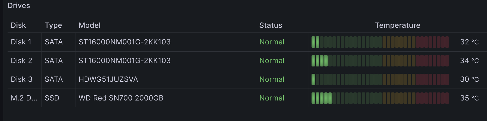
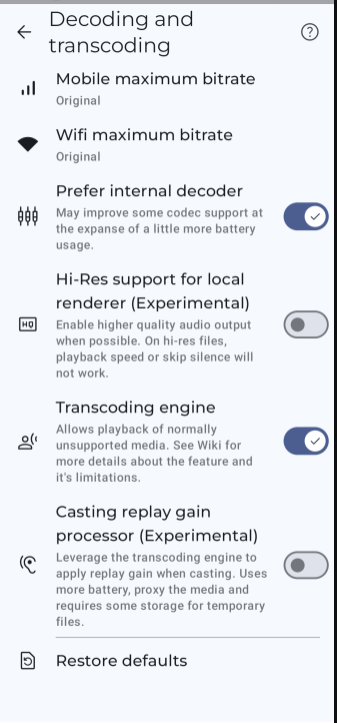
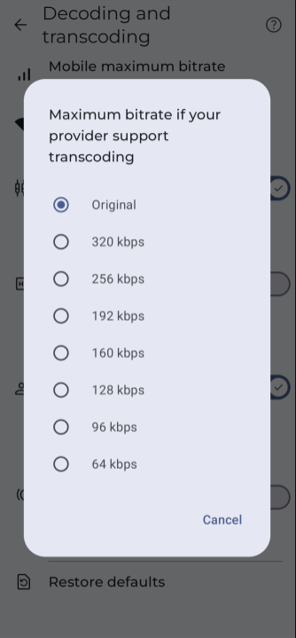
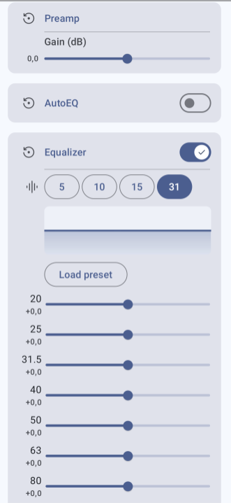
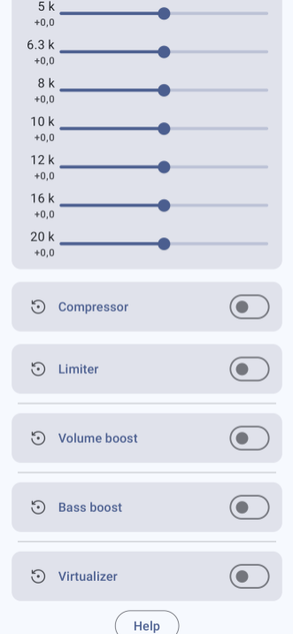
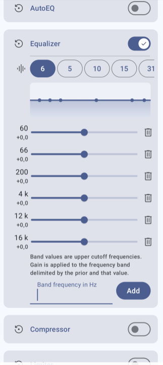
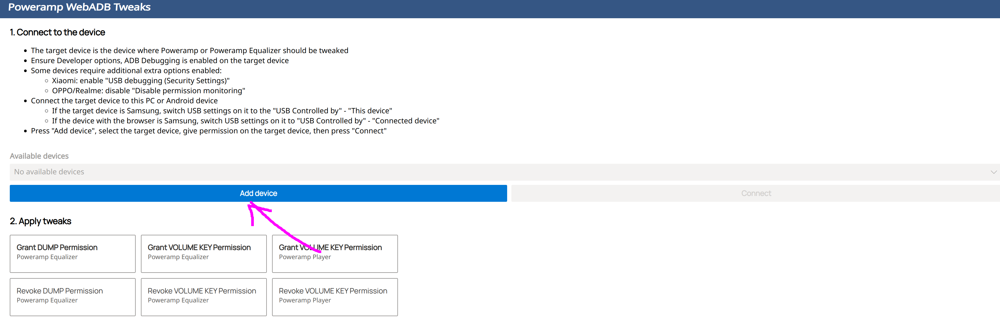
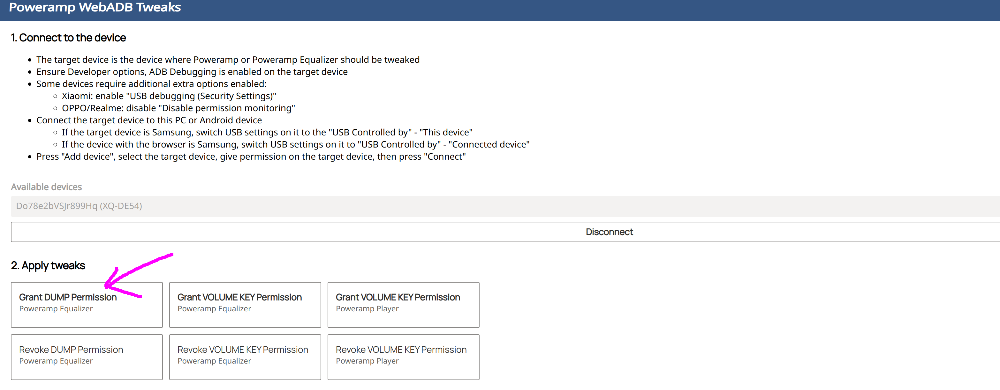
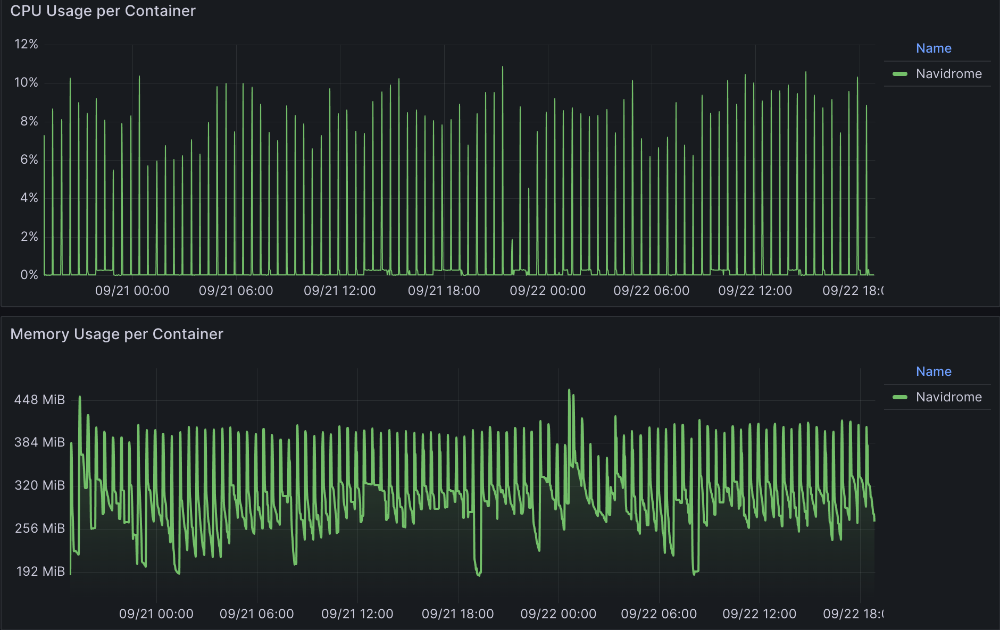

2024-10-03: Media server, Synology DS423+

About half a year ago, I made a pretty big purchase which I wanted to
share since this is relevant to audiophiles as well. A Synology DS423+
NAS, which if you do not know what a NAS is, it is essentially a mini-PC
with lots of storage capacity hooked up to your network so you can
access files everywhere in your home (and access it from anywhere in the
world if you want). I am using this as a way to store all my important
files away from my PC as a backup as well as hosting a few media servers
so I can stream my music and anime from it to my other devices.

This is the hardware I got:

Synology DS423+

Kingston 16GB DDR4 2666MT/s SODIMM KCP426SD8/16 (18GB TOTAL RAM WITH THE
STOCK 2GB STICK)

Western Digital SN700 M.2 2 TB PCI Express 3.0 NVMe (WDS200T1R0C)

2x Seagate 16TB Exos X16 (ST16000NM001G) & 1x Toshiba N300
(HDWG51JUZSVA) 18TB (in SHR RAID)

TP-Link RE450 Wifi extender (connect to the NAS via ethernet cable, as I
don't have any ethernet sockets I can use for it)

Eaton 3S 550VA (UPS), you get around 50 minutes battery life with this
UPS connected to the NAS with these HDDs.

You need to run a script to be able to set the 3rd party NVME SSD as a
storage pool instead of cache.
[*https://www.youtube.com/watch?v=sclQprHsXQE&list=PLJxPT5okRbkTh5vqBWRYM7T1bzHemYL3C*](https://www.youtube.com/watch?v=sclQprHsXQE&list=PLJxPT5okRbkTh5vqBWRYM7T1bzHemYL3C)

I bought the Toshiba N300 HDD months later as I started running out of
space on the 2x Seagate HDDs since I underestimated the amount of data I
would be able to store and not just delete right away on the NAS along
with the space taken by snapshots. I would recommend the Toshiba over
the Seagate from a noise perspective as I believe (hard to say for sure
since I already had the 2 Seagate´s when I added the Toshiba) it is
noticeably less noisy and seems to run cooler.

Software wise, the important ones I use are run via docker containers,
such as Pi-hole for an adblocker on the network level, Vaultwarden as a
password manager that is stored on the NAS and you can access via your
other devices if needed and the most important one for you guys
Navidrome, which is essentially your own Spotify streaming software.

Then to be able to connect to Navidrome on your smartphone I use
Symfonium ([**https://symfonium.app/**](https://symfonium.app/) ) , it
is Android only though, if you are on IOS you can use Finamp
(<https://github.com/jmshrv/finamp> ) and if on Windows/MAC/Linux you
can use Feishin (<https://github.com/jeffvli/feishin> ) which is what I
use on Linux.

You are able to adjust the band values for the EQ which is great
although it is missing the Q value adjustment as well as low/high-shelfs
for it to be a proper PEQ. And you can use AutoEQ profiles.

You can however use Poweramp Equalizer to achieve PEQ. Some settings you
need to enable in both your phone and Poweramp Equalizer. In your phone
enable Developer settings (look up how to do it in your specific phone)
and then enable USB debugging. In Poweramp Equalizer: Settings →
Equalizer → Advanced Player Tracking → enable Notification Listener
Permission, Enable Player Tracking and Dump Permission. To enable Dump
permission, you just need to connect your phone to your PC (after USB
debugging is on) and open this page: <https://powerampapp.com/webadb/>
(more info [here](<[Using ADB to allow Equaliser permissions for more audio applications - Equalizer App New Releases - Poweramp](https://forum.powerampapp.com/topic/20638-using-adb-to-allow-equaliser-permissions-for-more-audio-applications/))) click on the add device button and your phone should be there.

Then go open Symfonium and play something, reboot the
phone and then Symfonium should be shown in Poweramp Equalizer under
Known Players in the Equalizer settings and it should work now.

One of the best features Symfonium has though IMO, is that you can both
download the music from the Navidrome server to your phone cache and
therefore be able to listen to the files even if you are offline and you
can use transcoding to lower the bitrate of the files if needed. So, if
for example all your music on the Navidrome server is all in FLAC format
(so around 800-1400kbps bitrate) and your phone storage clearly cannot
store it all, you can just set the bitrate to be 320kbps (or 64kbps at
the lowest) and the downloaded files will be set to that lowered bitrate
and you can save a lot of space that way. You can also set bitrate to be
lower if you are on mobile network while higher on WIFI, although you
would need to be able to access your NAS externally for mobile network
which I personally do not for security reasons.

While I am not an expert in NAS, I did do quite a bit of research before
I pulled the trigger so here are some of the recommendations I got if
you want one for yourself. With the assumption that you want to be able
to run Navidrome at the least, which in my own setup with one device
connected (Symfonium on phone) with a library of around 500GB and 32 500
files takes around 150-250mb Ram at the bare minimum while idling with
average of 550mb ram during streaming to my phone. Simultaneous
streaming AND offline cache downloading takes up to around 1.75GB.

Do note that if your library is bigger than mine, it is likely to use
more ram.

Extreme budget:

- [Orange Pi Zero 2 W]([*https://www.aliexpress.com/item/1005005979335218.html)

Super budget:

- Raspberry Pi 4b 2gb ram (can pair it with a HDD case so you can use
  internal 3.5mm inch HDDs such as one from [Ugreen](https://www.aliexpress.com/item/1005006979292049.html) or [Orico](https://www.aliexpress.com/item/32823248641.html)

Budget:

- TERRAMASTER F2-223

- Qnap TS-233

Middle:

- Synology DS224+

- TERRAMASTER F2-423

Top:

- TERRAMASTRER F4-424 / F4-423

- Qnap TS-264

- Synology DS423+

Overall it depends on what budget you have and your needs.

Synology has the worst hardware (on paper) but has the best software,
support (as far as I know) and is the most popular and you be able to
find help/guides a lot easier for them. Qnap and Terramaster has great
hardware but Qnap in particular has a horrible reputation in regards to
their security (which should not be a problem at all if you are running
the nas local only), while Terramaster I believe is the least popular
and you find the least guides on them. There is also the brand new
UGREEN NAS but I do not recommend them as they are too new and it is too
much of an uncertainty on how they will fare in long term usage (in
terms of both support duration and security), their hardware IS leagues
ahead of the market though.

If you have a lot of files to store then the DS224+ with only 2 HDD
slots might not be enough for you since you probably want to run it in
raid redundant mode (mirrored hdd, so you only get 1 slot with useable
storage and the other hdd will act as your "backup" in case the other
dies). In which case you probably want the F2-223 at least since you
could store some files on the SSD. If you only want to run Navidrome and
want external access and you store less than 2 TB atm, then the DS224+
or even the raspberry pi 4b should be the better option.

My recommendation is that you should avoid the 2 bay NAS as they are too
limited and is likely to not be enough for long term usage. As you
likely want to run some form of raid config, you would only have access
to a single slot for storage and the other for redundancy.

Do note that you should do your own research since your use case might
be different from what I have imagined here and because of the varying
prices of NAS devices region from region (and availability).

There is also the option to turn any old pc you have into a NAS with
something like UnRAID/trueNAS.

Here are a few other helpful links:

<https://itsfoss.com/raspberry-pi-install-docker/>

[How to install Docker (and Portainer) on a RaspberryPi and run millions
of apps on your RaspberryPi!]([How to install Docker (and Portainer) on a RaspberryPi and run millions of apps on your RaspberryPi! - YouTube](https://www.youtube.com/watch?v=O7G3oatg5DA))

[*https://mariushosting.com/*](https://mariushosting.com/)

[*https://mariushosting.com/how-to-install-navidrome-on-your-synology-nas/*](https://mariushosting.com/how-to-install-navidrome-on-your-synology-nas/)

[*https://github.com/psybernoid/QNAPDocker*](https://github.com/psybernoid/QNAPDocker)

[*https://www.wundertech.net/category/docker/*](https://www.wundertech.net/category/docker/)

[*https://www.linuxfordevices.com/tutorials/linux/install-setup-navidrome*](https://www.linuxfordevices.com/tutorials/linux/install-setup-navidrome)

Some other recommendations on what you can do with a NAS, mostly has to
do with what docker containers you run on it. Here are some
recommendations that I have yet to mention:

- Portainer: GUI for docker management, great tool to manage the other
  containers you have from creating to editing.

- Paperless-ngx: Great tool to gather and organize your
  
  > documents/mails, you can use this to automatically convert emails
  > into documents and then store it in your NAS in a well-organized
  > method. Example would be to use it to store and organize your
  > digital receipts.

- Stirling PDF: If you work with PDF files this has a TON of features
  
  > for them, way too many to list so just take a look [here]([GitHub - Stirling-Tools/Stirling-PDF: #1 Locally hosted web application that allows you to perform various operations on PDF files](https://github.com/Stirling-Tools/Stirling-PDF?tab=readme-ov-file#pdf-features))

- Linkwarden: Bookmark manager to collect, organize and archive
  
  > webpages. Great for organizing your bookmarks with the help of
  > tags and other tools as well as automatically take a screenshot,
  > pdf or html file of the saved site for darchiving.

- Whoogle: Use Google as the search engine but no ads, JavaScript, AMP
  
  > links, cookies, or IP address tracking.

- Redlib: Use Reddit without tracking, ads and bloat.

- IT-Tools: Lots of different features meant mostly for
  
  > developers/IT-people but has useful features like generate random
  > string so that you can use as passwords if you want something
  > secure and are a bit paranoid about using free online random
  > generators for your passwords.

- Pairdrop: Sharing files from device to device quickly and privately.

- Morphos Server: A file converter.

- RSSHub: An RSS feed generator.

- Miniflux: RSS reader, combine this with RSSHub and you can read on
  
  > PC. "Read You", is an RSS reader on android.

- Syncthing: Continuous file synchronization program.

- Website Shot: Website screenshot tool, useful to take full screen
  
  > screenshots in a single picture and can also take them in dark or
  > light mode.

- MeTube: Youtube downloader

- Squoosh: An image compression web app that reduces image sizes

- Grafana & Prometheus: System monitoring and display system, it is
  
  > what I use to monitor my NAS and gives more detailed info on
  > resource consumption.

Oh and lastly some side notice, If your PC is still on Windows 10,
Microsoft will end their support of it next year (October 14^th^). I
highly recommend that you ditch them afterwards because Windows 11 is
terrible in many ways. I myself have just recently switched over to
Linux, specifically the Linux Mint distribution as I found it the most
similar to Windows (Zorin OS is another alternative). And if you are
using Bluetooth on your PC, switching to Linux is a big advantage for it
as you will then have access to SBC-XQ which is comparable to APTX HD (
<http://soundexpert.org/articles/-/blogs/audio-quality-of-sbc-xq-bluetooth-audio-codec>
) (Every bluetooth device has SBC as it is the mandatory default codec
which also means it has SBC-XQ support).
